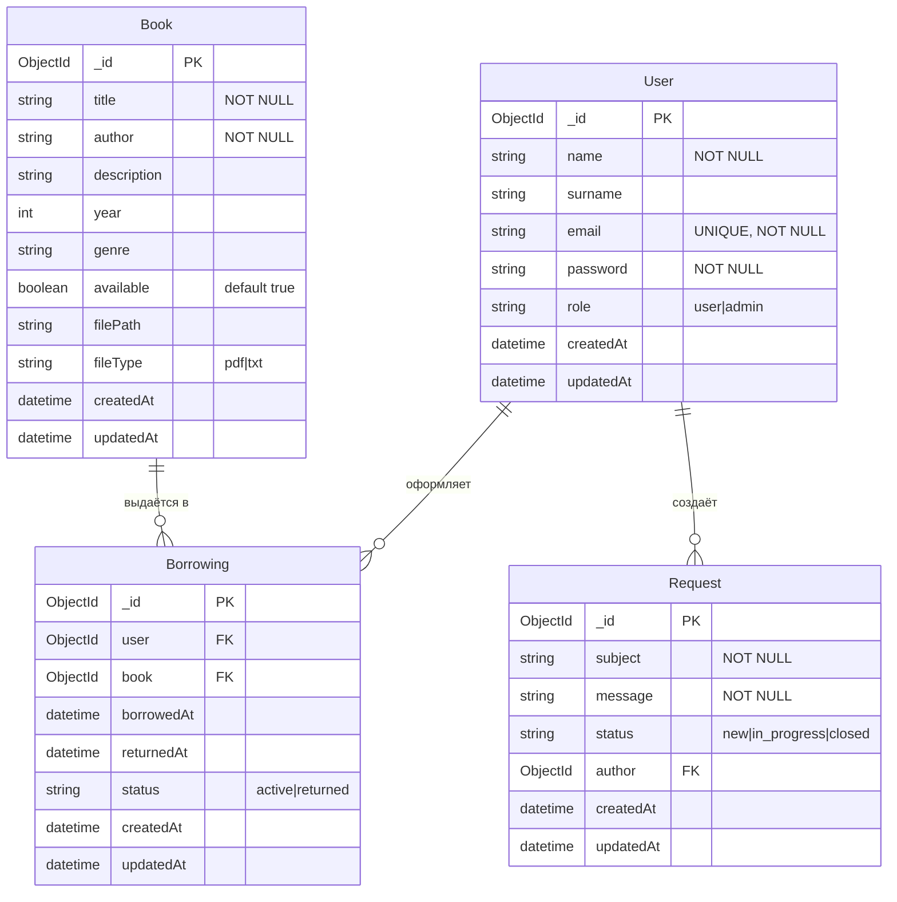

# ER-диаграмма (Entity-Relationship)

Модель данных системы управления библиотекой. Соответствует разделам 1.3 и 1.4 ВКР.

## Диаграмма сущностей и связей

## Описание связей

| Связь | Тип | Описание |
|-------|-----|----------|
| User → Borrowing | 1:N | Один пользователь может иметь несколько активных выдач |
| Book → Borrowing | 1:N | Одна книга может быть выдана разным пользователям в разное время |
| User → Request | 1:N | Один пользователь может создать несколько обращений |

## Кардинальность

- **User — Borrowing**: один ко многим (1:N). Пользователь может оформить множество выдач.
- **Book — Borrowing**: один ко многим (1:N). Книга участвует в множестве выдач (история).
- **User — Request**: один ко многим (1:N). Пользователь может создать множество обращений.

## Индексы (MongoDB)

- `User`: `email` (unique)
- `Book`: `{ title: "text", author: "text" }`, `{ genre: 1 }`
- `Borrowing`: составной индекс по `(user, book, status)` для быстрого поиска активных выдач
