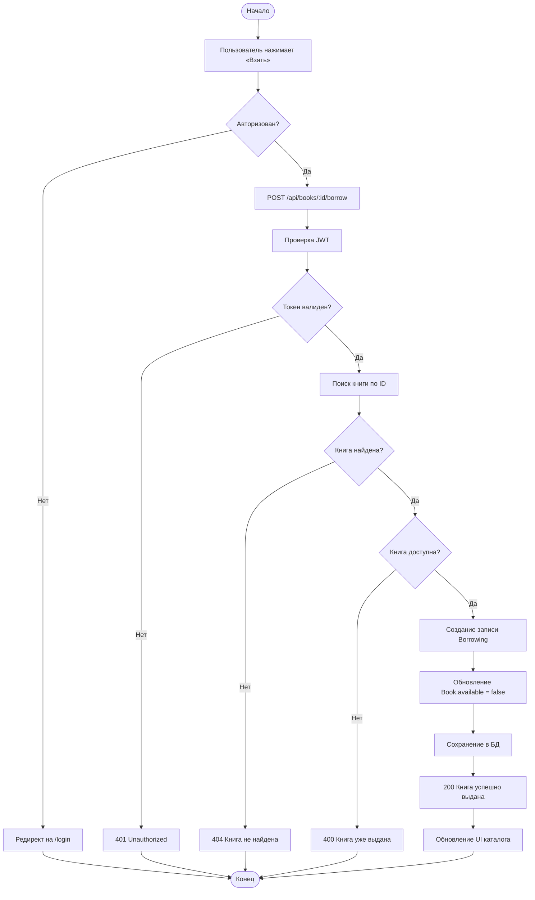
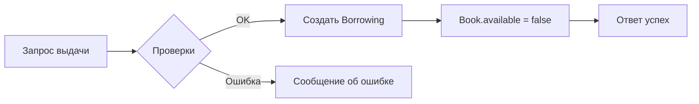

# UML: Диаграмма активности — сценарий бронирования книги

Описывает поток операций при выдаче книги пользователю. Соответствует разделу 1.4 ВКР.

## Диаграмма активности

## Упрощённая диаграмма (основной поток)

## Описание этапов

1. **Инициация** — пользователь нажимает кнопку «Взять» в каталоге.
2. **Проверка авторизации** — наличие JWT-токена.
3. **Проверка доступности** — книга существует и `available === true`.
4. **Транзакционная операция** — создание Borrowing и обновление Book в рамках логической последовательности.
5. **Ответ клиенту** — обновление интерфейса (каталог, «Мои книги»).
