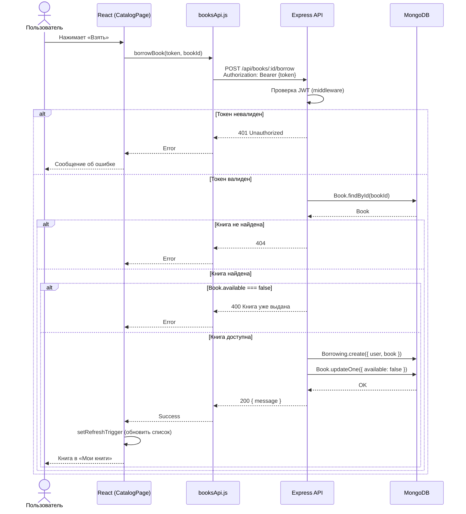
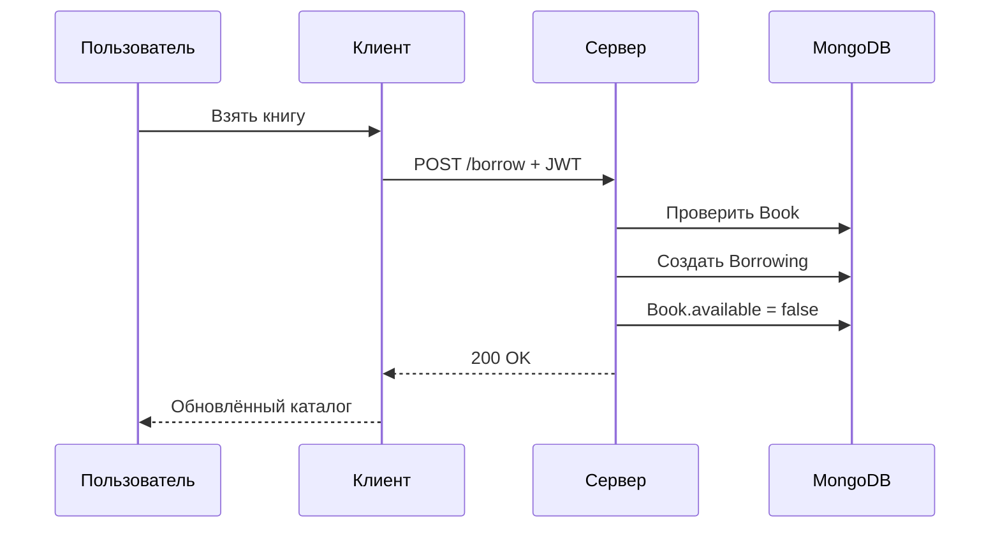

# UML: Диаграмма последовательности — сценарий бронирования

Взаимодействие участников при выдаче книги. Соответствует разделу 1.4 ВКР.

## Диаграмма последовательности

## Упрощённая диаграмма (успешный сценарий)

## Участники

| Участник | Роль |
|----------|------|
| Пользователь | Инициатор действия |
| React (UI) | Клиентское приложение, отображение и вызов API |
| booksApi.js | Клиентский слой работы с API |
| Express API | Серверная логика, валидация, доступ к БД |
| MongoDB | Хранилище данных |
