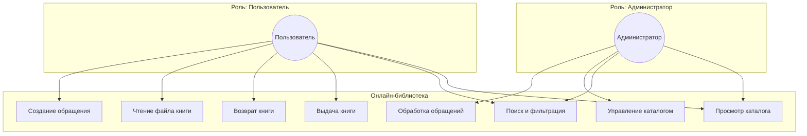
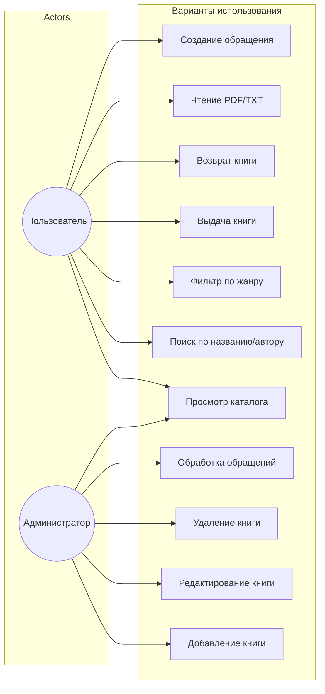

# UML: Диаграмма вариантов использования (Use Case)

Обзор основных сценариев системы. Соответствует разделу 1.1 ВКР (роли пользователей).

## Диаграмма Use Case

## Диаграмма Use Case (стандартная нотация)

## Описание вариантов использования

| Вариант | Актор | Описание |
|---------|-------|----------|
| Просмотр каталога | Пользователь, Админ | Отображение списка книг с пагинацией |
| Поиск | Пользователь, Админ | Поиск по названию, автору |
| Фильтр по жанру | Пользователь, Админ | Фильтрация по Novel, Fantasy, Detective |
| Выдача книги | Пользователь | Бронирование доступной книги (требует авторизации) |
| Возврат книги | Пользователь | Возврат выданной книги |
| Чтение файла | Пользователь | Чтение PDF/TXT с настройками (фон, шрифт) |
| Создание обращения | Пользователь | Отправка запроса в поддержку |
| Управление каталогом | Админ | CRUD книг, загрузка файлов |
| Обработка обращений | Админ | Просмотр и смена статуса обращений |
