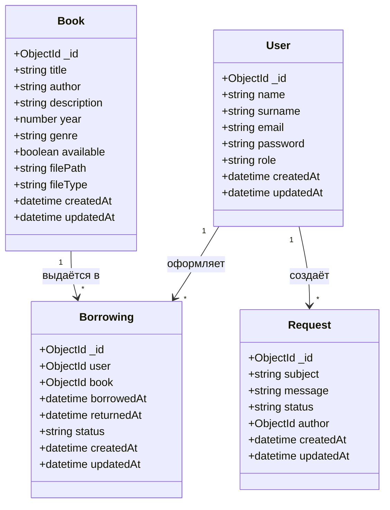

# UML: Диаграмма классов

Структура основных сущностей системы. Соответствует разделу 1.4 ВКР.

## Диаграмма классов

## Описание классов

| Класс | Назначение |
|-------|------------|
| **User** | Пользователь системы (роли: user, admin) |
| **Book** | Книга в каталоге, метаданные и путь к файлу |
| **Borrowing** | Выдача книги пользователю (связь User–Book) |
| **Request** | Обращение пользователя в поддержку |
