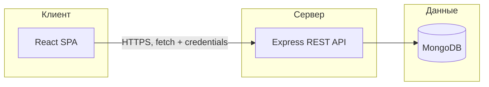

# Онлайн-библиотека: архитектура и материалы для ВКР

Краткое описание для пояснительной записки, презентации и проверки перед защитой.

## Назначение

Веб-приложение имитирует работу библиотеки: каталог книг, выдача на время чтения, онлайн-просмотр файлов без отдельной «кнопки скачивания», избранное, обращения читателей, администрирование каталога и пользователей.

## Стек технологий

| Уровень | Технологии |
|--------|------------|
| Клиент | React, React Router, Vite |
| Сервер | Node.js, Express |
| Данные | MongoDB, Mongoose |
| Прочее | JWT в httpOnly-cookie, подтверждение email (SMTP), ограничение частоты запросов |

## Логическая архитектура

Пользователь работает в браузере с одностраничным приложением (SPA). Запросы к API идут по HTTP(S); сессия после входа хранится в защищённой cookie (`httpOnly`), фронтенд отправляет её автоматически при `credentials: "include"`.

## Роли и сценарии

### Гость (не авторизован)

- Просмотр каталога и поиск книг.
- Просмотр карточки книги (описание, метаданные).
- Регистрация и вход (после регистрации — подтверждение email, если настроена почта).
- При попытке открыть разделы только для пользователя — перенаправление на вход или показ запроса авторизации (в зависимости от экрана).

### Пользователь (читатель)

- Всё, что доступно гостю.
- Взять книгу «на руки» (если доступна), вернуть книгу.
- Раздел «Мои книги», онлайн-чтение выданных книг (в приложении или в новой вкладке для совместимости форматов).
- Избранное.
- Подача и просмотр своих обращений / запросов в библиотеку.

### Администратор

- Всё, что доступно пользователю (по учётной записи с ролью admin).
- CRUD книг в каталоге, загрузка файлов для чтения (где предусмотрено интерфейсом).
- Просмотр и обработка обращений пользователей.
- Управление пользователями (экраны админ-панели в маршрутах `/admin`).

Маршруты защищены на клиенте (`PrivateRoute`, `AdminRoute`) и проверяются на сервере по JWT из cookie и роли.

## Чеклист скриншотов для записки / слайдов

Снимите в одном стиле (один браузер, светлая тема, без лишних личных данных):

1. Главная / каталог с поиском.
2. Карточка книги (до и после входа — если показываете выдачу).
3. Страница онлайн-чтения или предпросмотра.
4. Форма входа и регистрации.
5. «Мои книги» с активной выдачей.
6. Избранное.
7. Список обращений пользователя.
8. Админка: список книг и форма создания/редактирования.
9. Админка: обращения и (при наличии в проекте) пользователи.

Дополнительно: один скрин диаграммы или этого файла в приложении к главе «Архитектура».

## Развёртывание и переменные окружения

### Один origin (фронт и API за одним доменом или через reverse proxy)

Достаточно выставить `NODE_ENV=production`, HTTPS, секреты БД и JWT. Cookie по умолчанию: `SameSite=Strict`, `Secure` — подходит.

### Разные домены (например, фронт на хостинге статики, API отдельно)

1. **Клиент:** в `.env` сборки задайте полный URL API, например  
   `VITE_API_URL=https://api.ваш-домен.ru`  
   (см. `client/.env.example`).

2. **Сервер:** в `CORS_ORIGINS` перечислите через запятую точные origin фронтенда, например  
   `CORS_ORIGINS=https://app.ваш-домен.ru`

3. **Cookie между разными сайтами:** включите  
   `COOKIE_CROSS_ORIGIN=true`  
   Тогда для cookie используется `SameSite=None` и `Secure` (нужен HTTPS на API). Иначе браузер не отправит cookie при запросах с другого домена.

4. **Письма:** `CLIENT_URL` должен указывать на публичный URL фронтенда (ссылки «Подтвердить email»).

Подробности для локальной разработки — в `server/.env.example` и `client/.env.example`.
